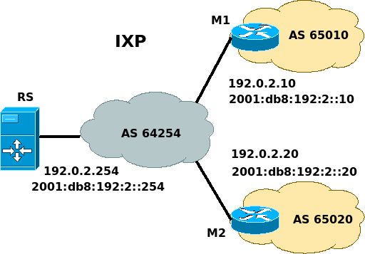

# BIRD Route Server

### Ejecución
Para ejecutar la version 2.0.1 de bird dentro de un contenedor de docker seguimos los siguientes pasos

1. Creamos una imagen de docker a partir del archivo [Dockerfile](Dockerfile)
```sh
$ mkdir mydockerbuild_bird
$ cd mydockerbuild_bird
$ wget https://github.com/sancolo/rpki-lab/bird/Dockerfile
$ sudo docker build -t bird-2.0.1 .
```
2. Verificamos que la imagen esta creada en el host
```sh
$ docker images
REPOSITORY                  TAG                 IMAGE ID            CREATED             SIZE
bird-2.0.1                  latest              6c4040cd8d28        11 days ago         392MB
```
3. Creamos el directorio rsbird y copiamos los archivos [rsbird.conf](rsbird.conf), [filters.conf](filters.conf), [memebers.conf](members.conf) y [rpki.conf](rpki.conf) en el directorio rsbird
```sh
$ mkdir $HOME/rsbird
$ cd $HOME/rsbird
$ wget -A \*.conf https://github.com/sancolo/route-server-rpki-validator/
$ ln -s rsbird.conf bird.conf
```
4. Ejecutamos el contenedor a partir de la imagen creada y montando el directorio local donde se encuentra el archivo de configuracion bird.conf para BIRD
```sh
$ sudo docker run -d --privileged --name rsbird -v `$HOME/rsbird:/etc/bird:rw -h rsbird -p 179:179 bird-2.0.1
```
Podemos agregar la opción --restart unless-stopped para que al reinicio del demonio docker se ejecute el contenedor rsbird.

5. Verificamos que el contenedor se esta ejecutando
```sh
$ docker ps
CONTAINER ID        IMAGE               COMMAND                  CREATED             STATUS        PORTS        NAMES
1611c3c34128        bird-2.0.1          "/bin/sh -c 'bird -c…"   6 days ago          Up 6 days     179/tcp      rsbird
```
6. Para entrar al contenedor ejecutamos
```sh
$ sudo docker exec -it rsbird /bin/bash
root@1611c3c34128:~# birdc
BIRD 2.0.1 ready.
bird> show status
BIRD 2.0.1
Router ID is 172.17.0.3
Current server time is 2018-02-26 22:05:01.227
Last reboot on 2018-02-20 15:46:49.565
Last reconfiguration on 2018-02-21 21:07:36.712
Daemon is up and running
bird>     
```

### Configuración

Los cambios en la configuración de BIRD pueden hacerse desde el directorio $HOME/rsbird del usuario que ejecuta el contenedor en el host y luego desde la consola del contenedor rsbird usamos birdc y ejecutamos:
```sh
birdc> configure check
Reading configuration from /etc/bird/bird.conf
Configuration OK
bird> configure 
Reading configuration from /etc/bird/bird.conf
Reconfigured
bird>
```

Los archivos *.conf* de BIRD corresponden a un escenario de prueba de un Route Server y dos miembros del IXP como se muestra a en la imagen.


 
